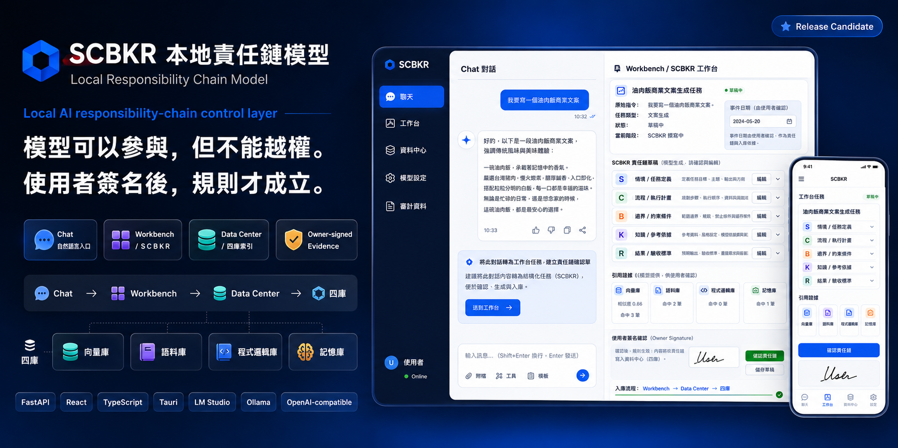
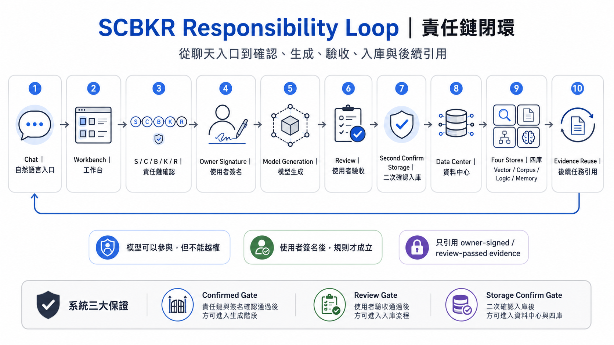
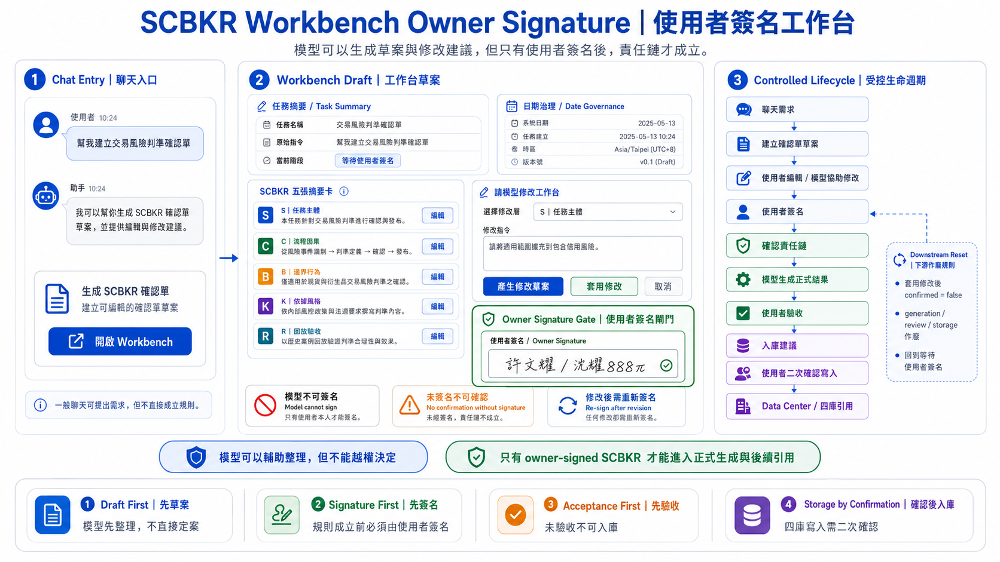
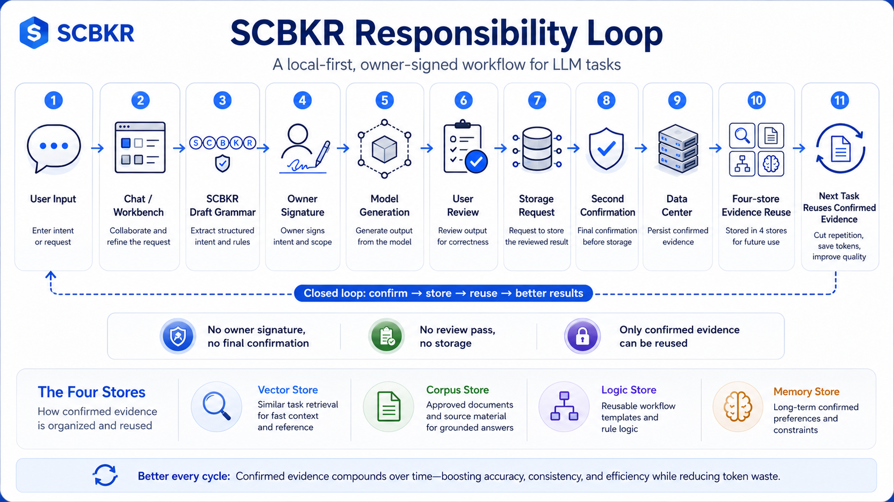
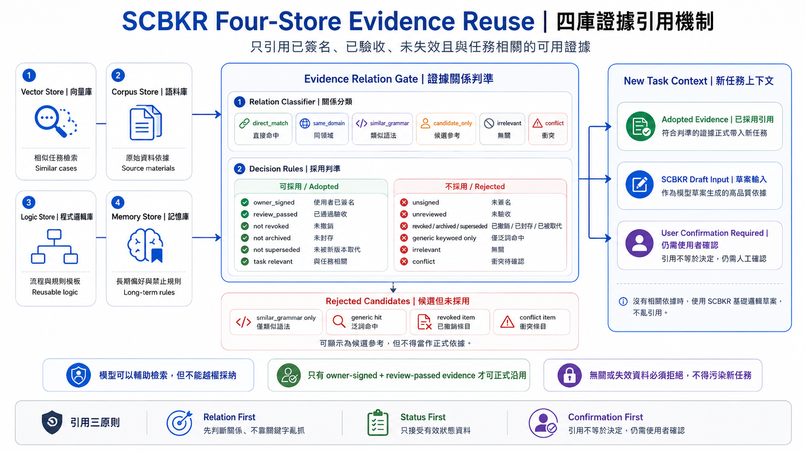
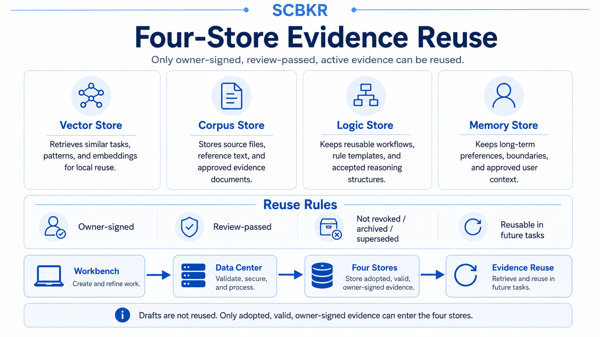
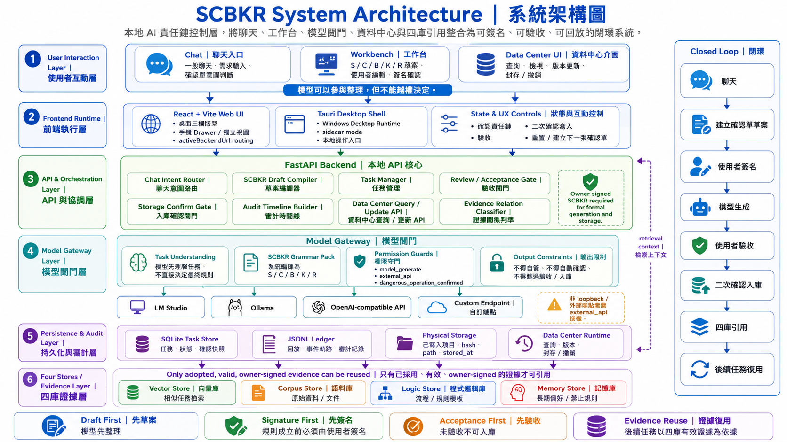
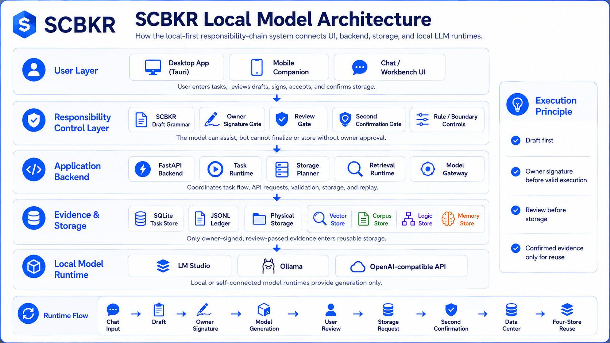
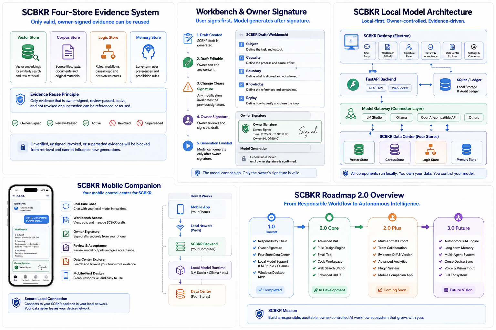
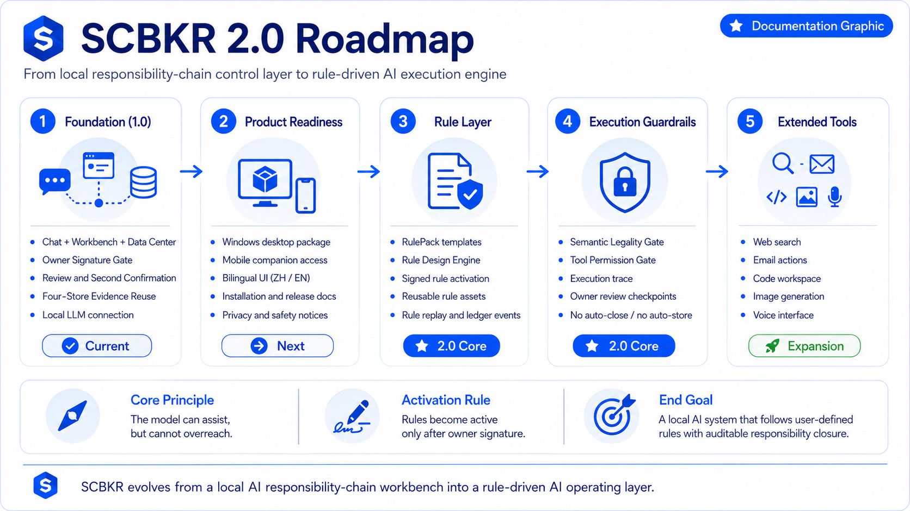

# SCBKR 本地責任鏈模型
# SCBKR Local Responsibility Chain Model



本地 AI 責任鏈工作台｜使用者簽名 Gate｜Data Center｜四庫引用｜Release Candidate  
Local AI responsibility-chain workbench | Owner Signature Gate | Data Center | Four-store evidence reuse | Release Candidate

SCBKR 不是一般聊天機器人。SCBKR 是一套本地 AI 責任鏈工作台。模型可以協助，但不能越權。使用者簽名後，責任鏈才成立。驗收後才可入庫。二次確認後才可寫入四庫。

SCBKR is not a general chatbot. It is a local AI responsibility-chain workbench. The model can assist, but it cannot overreach. Owner signature makes the responsibility chain valid. User review is required before storage, and storage requires second confirmation.

中文一句話：SCBKR 是一套本地 AI 責任鏈工作台，讓模型在生成、記憶、入庫與未來引用之前，必須先經過使用者確認單、簽名、驗收與二次確認。

English one-line: SCBKR is a local AI responsibility-chain workbench that requires owner confirmation, signature, user review, and second confirmation before model output can become stored evidence or reusable memory.

## 1. 快速理解｜Quick Overview

- 中文：SCBKR 把「任務、流程、邊界、依據、驗收」整理成 S/C/B/K/R 確認單，要求使用者簽名後才允許模型生成。
- English: SCBKR turns task, causal flow, boundaries, knowledge basis, and review criteria into an S/C/B/K/R confirmation sheet that must be owner-signed before generation.
- 中文：它不是自動代理，也不是雲端帳號服務；1.0 是本機責任鏈 Workbench。
- English: It is not an autonomous agent or cloud account service; 1.0 is a local responsibility-chain workbench.

## 2. 目前版本｜Current Version

- 中文：目前版本為 `0.15.0-rc.2`，階段為 `P15-S-1.0-final-rc`。
- English: Current version is `0.15.0-rc.2`, stage `P15-S-1.0-final-rc`.
- 中文：這是 Release Candidate，不是正式 production release；預設無自動更新、無簽章、無內建模型、無內建 API key。
- English: This is a release candidate, not a production release; it has no auto-update, no code signing by default, no bundled model, and no bundled API key.

## 3. 1.0 目前能做什麼｜What 1.0 Can Do

- 中文：建立 S/C/B/K/R 任務確認單、使用者簽名、生成、驗收、入庫請求、二次確認、Data Center 檢視與四庫引用。
- English: It supports S/C/B/K/R task confirmation, owner signature, generation, review, storage request, second confirmation, Data Center viewing, and four-store evidence reuse.
- 中文：模型只能提出草案或建議，不能自行簽名、驗收、入庫或修改已寫入資料。
- English: The model may draft or suggest, but it cannot sign, review, store, or rewrite committed evidence by itself.

## 4. Desktop Mode 與 LAN Companion Mode｜Desktop Mode and LAN Companion Mode

### Desktop Mode｜預設模式

- 中文：Windows Desktop RC 預設綁定 `http://127.0.0.1:8787`，只能本機電腦連線，這是最安全模式。
- English: The Windows Desktop RC binds to `http://127.0.0.1:8787` by default; only the local computer can connect, which is the safest mode.
- 中文：預設模式下，手機不能直接用 `192.168.x.x` 連入。
- English: In default mode, a phone cannot directly connect through `192.168.x.x`.

### LAN Companion Mode｜使用者手動開啟

- 中文：使用者手動啟動 LAN Companion Mode 後，sidecar 才可綁定 `0.0.0.0:8787`。
- English: Only after the user manually starts LAN Companion Mode may the sidecar bind to `0.0.0.0:8787`.
- 中文：手機可在同 Wi‑Fi / LAN 以 `http://192.168.x.x:8787/?companion_token=<token>` 開啟 Web UI。
- English: A phone on the same Wi‑Fi / LAN may open the Web UI at `http://192.168.x.x:8787/?companion_token=<token>`.
- 中文：LAN Companion Mode 需要 companion token，不會預設開啟。
- English: LAN Companion Mode requires a companion token and is never enabled by default.

## 5. 完整責任鏈流程｜Responsibility Chain Flow




- 中文：輸入任務 → 產生確認單 → 使用者簽名 → 模型生成 → 使用者驗收 → 入庫建議 → 二次確認 → 寫入四庫 / Data Center。
- English: Input task → build confirmation sheet → owner signature → model generation → user review → storage suggestion → second confirmation → write to four stores / Data Center.

## 6. Workbench 與使用者簽名｜Workbench and Owner Signature




- 中文：Workbench 是使用者檢查與修改 S/C/B/K/R 的地方；任何修改都會使舊簽名與下游生成、驗收、入庫狀態作廢。
- English: The Workbench is where the user reviews and edits S/C/B/K/R; any edit invalidates the old signature and downstream generation, review, and storage state.
- 中文：模型不能簽名，`confirmed_by` 必須是 `user`，signature 不可空。
- English: The model cannot sign; `confirmed_by` must be `user`, and the signature cannot be empty.

## 7. Data Center 與四庫｜Data Center and Four Stores




- 中文：四庫只能是 `vector`、`corpus`、`logic`、`memory`。
- English: The only allowed stores are `vector`, `corpus`, `logic`, and `memory`.
- 中文：`exports` 不是 storage target，也不得恢復為 storage target。
- English: `exports` is not a storage target and must not be restored as one.
- 中文：Data Center 更新 / 刪除必須有使用者簽名；revoked / archived / superseded 資料不得作為可用引用。
- English: Data Center update / delete requires user signature; revoked / archived / superseded evidence cannot be reused as available evidence.

## 8. 本地模型支援｜Local Model Support




- 中文：1.0 支援 sandbox、本地 LLM、LM Studio、Ollama 或 OpenAI-compatible endpoint 設定。
- English: 1.0 supports sandbox, local LLM, LM Studio, Ollama, or an OpenAI-compatible endpoint.
- 中文：外部 API 權限預設關閉；非 loopback 模型網址需要使用者開啟 external API guard。
- English: External API permission is off by default; non-loopback model URLs require the user to enable the external API guard.

## 9. Windows 安裝與啟動｜Windows Setup

- 中文：Desktop RC 預設啟動本機 sidecar：`http://127.0.0.1:8787`。
- English: The Desktop RC starts the local sidecar by default at `http://127.0.0.1:8787`.
- 中文：健康檢查：`curl http://127.0.0.1:8787/health`。
- English: Health check: `curl http://127.0.0.1:8787/health`.
- 中文：一般使用者不需要 Python、Node、npm、uvicorn、PowerShell、LM Studio、Ollama 或 API key 即可測試 sandbox 流程。
- English: Normal users do not need Python, Node, npm, uvicorn, PowerShell, LM Studio, Ollama, or an API key to test the sandbox flow.

## 10. 手機遙控｜Mobile Companion



- 中文：手機不是直接連本地 LLM。
- English: The phone does not connect directly to the local LLM.
- 中文：手機只是操作入口。
- English: The phone is only an operation entry point.
- 中文：手機瀏覽器先連到電腦上的 SCBKR LAN Companion Web UI。
- English: The phone browser connects to the SCBKR LAN Companion Web UI running on the computer.
- 中文：手機 → SCBKR 後端 → 本地 LLM。所有模型呼叫仍由電腦上的 SCBKR 後端執行。
- English: Phone → SCBKR backend → local LLM. All model calls are still executed by the SCBKR backend on the computer.
- 中文：本地 LLM / LM Studio / Ollama / OpenAI-compatible API 仍由電腦端設定。
- English: Local LLM / LM Studio / Ollama / OpenAI-compatible API settings remain computer-side settings.
- 中文：手機端不能繞過使用者簽名、驗收、二次確認、Data Center Gate 或四庫限制。
- English: The phone cannot bypass owner signature, user review, second confirmation, the Data Center Gate, or four-store limits.
- 中文：啟動方式：在 Windows 上執行 `powershell -ExecutionPolicy Bypass -File scripts/start_lan_companion_windows.ps1`，依畫面顯示的 URL 在手機瀏覽器開啟。
- English: Start it on Windows with `powershell -ExecutionPolicy Bypass -File scripts/start_lan_companion_windows.ps1`, then open the displayed URL in the phone browser.

## 11. 隱私與安全邊界｜Privacy and Safety Boundary

- 中文：預設 Desktop Mode 僅本機可連，LAN Companion Mode 只適合可信任 Wi‑Fi。
- English: Default Desktop Mode is local-only; LAN Companion Mode should only be used on trusted Wi‑Fi.
- 中文：不要把含 token 的 URL 貼到公開地方；token 由 launcher 或使用者設定產生，不寫入 Git，也不固定寫死。
- English: Do not publish URLs containing tokens; tokens are generated by the launcher or user config, not committed to Git or hard-coded.

## 12. 與 Chatbot / Agent / RAG 的差異｜Difference from Chatbot / Agent / RAG

- 中文：Chatbot 重點是對話；Agent 重點是自動行動；RAG 重點是檢索增強。SCBKR 重點是責任鏈、簽名、驗收、入庫與未來引用邊界。
- English: Chatbots focus on conversation; agents focus on autonomous action; RAG focuses on retrieval augmentation. SCBKR focuses on responsibility chain, signature, review, storage, and future reuse boundaries.

## 13. 2.0 Roadmap｜2.0 Roadmap



- 中文：下一階段才是 P16 / SCBKR 2.0 Rule Design Engine 與 Store Packaging。
- English: The next phase is P16 / SCBKR 2.0 Rule Design Engine and Store Packaging.
- 中文：1.0 不包含 RulePack、Semantic Legality Gate、Web Search、Email Tool、Code Workspace、Voice I/O、Image Generation、Rule Marketplace、subscription、原生 Android/iOS app、cloud account 或 team account。
- English: 1.0 does not include RulePack, Semantic Legality Gate, Web Search, Email Tool, Code Workspace, Voice I/O, Image Generation, Rule Marketplace, subscriptions, native Android/iOS apps, cloud accounts, or team accounts.

## 14. 開發者快速啟動｜Developer Quick Start

```bash
python -m pytest -q
npm --prefix apps/web run build
npm --prefix apps/desktop run check:skeleton
npm --prefix apps/desktop run check:release
```

- Windows 一鍵開啟完整本機 UI：`powershell -ExecutionPolicy Bypass -File scripts/start_ui_review_windows.ps1`
- 桌機與手機版實機驗收：`powershell -ExecutionPolicy Bypass -File scripts/run_ui_acceptance_windows.ps1`
- UI 驗收會啟動真實 FastAPI 與 Web UI、操作主要頁面、檢查瀏覽器錯誤與畫面溢出，並將各頁截圖附在 HTML 報告中。
- UI acceptance starts the real FastAPI and Web UI, exercises primary pages, checks browser errors and viewport overflow, and attaches screenshots to an HTML report.

- 中文：本機 API 預設：`http://127.0.0.1:8787`。
- English: Default local API: `http://127.0.0.1:8787`.
- 中文：API base 會依 runtime matrix 判斷：LAN Companion 頁面使用目前頁面 origin；localhost dev / preview 頁面仍連回 FastAPI sidecar `http://127.0.0.1:8787`；`VITE_SCBKR_API_URL` 永遠最高優先。
- English: The API base follows a runtime matrix: LAN Companion pages use the current page origin, localhost dev / preview pages still call the FastAPI sidecar at `http://127.0.0.1:8787`, and `VITE_SCBKR_API_URL` always has the highest priority.

## 15. 測試與驗收｜Testing and Validation

- 中文：Release readiness 檢查包含 sidecar host/port、LAN token、web-dist 服務、frontend API base、Gate 保存、README 圖片與文件連結。
- English: Release readiness checks cover sidecar host/port, LAN token, web-dist serving, frontend API base, gate preservation, README images, and documentation links.
- 中文：Windows 上可執行 release build / smoke / LAN Companion smoke PowerShell 腳本。
- English: On Windows, run the release build / smoke / LAN Companion smoke PowerShell scripts.

## 16. 1.0 上架狀態｜1.0 Release Readiness

- 中文：`0.15.0-rc.2` 可作為 1.0 Final RC；production release、code signing、auto-update、store packaging 仍為 false / 下一階段。
- English: `0.15.0-rc.2` can serve as the 1.0 Final RC; production release, code signing, auto-update, and store packaging remain false / next phase.
- 中文：Desktop Mode 預設 local-only；LAN Companion Mode 已支援但需手動啟動與 token。
- English: Desktop Mode is local-only by default; LAN Companion Mode is supported but requires manual launch and a token.

## 17. License / Author

- 中文：作者：許文耀／沈耀888pi，語意防火牆。授權請以 repository license 為準。
- English: Author: Wen-Yao Hsu / ShenYao888pi, Semantic Firewall. License follows the repository license.
