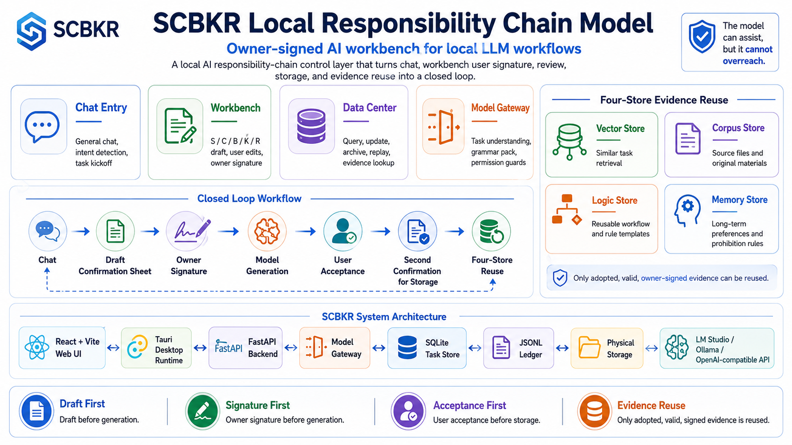

# SCBKR 本地責任鏈模型｜Local Responsibility Chain Model

<p align="center">
  
</p>

<p align="center">
  <strong>Local AI responsibility-chain control layer with owner-signed Workbench, Data Center, and four-store evidence reuse.</strong>
</p>

<p align="center">
  
  
  
  
  
  
</p>

---

## 目錄

* [一、產品定位](#一產品定位)
* [二、SCBKR 不是什麼](#二scbkr-不是什麼)
* [三、SCBKR 解決什麼問題](#三scbkr-解決什麼問題)
* [四、核心閉環](#四核心閉環)
* [五、SCBKR 五維責任鏈](#五scbkr-五維責任鏈)
* [六、模型角色與行動邊界](#六模型角色與行動邊界)
* [七、Chat 與 Workbench](#七chat-與-workbench)
* [八、Owner Signature Gate｜使用者簽名閘門](#八owner-signature-gate使用者簽名閘門)
* [九、Data Center 與四庫](#九data-center-與四庫)
* [十、Evidence Relation Gate｜證據關係判準](#十evidence-relation-gate證據關係判準)
* [十一、為什麼 SCBKR 不依賴無限聊天上下文](#十一為什麼-scbkr-不依賴無限聊天上下文)
* [十二、權限與安全邊界](#十二權限與安全邊界)
* [十三、系統架構](#十三系統架構)
* [十四、目前版本進度](#十四目前版本進度)
* [十五、P15-Q 尚未完成的收束項](#十五p15-q-尚未完成的收束項)
* [十六、目前可跑能力](#十六目前可跑能力)
* [十七、使用方式｜Desktop App 與開發者模式](#十七使用方式desktop-app-與開發者模式)
* [十八、常用測試](#十八常用測試)
* [十九、模型接入](#十九模型接入)
* [二十、手機與遠端自接入使用](#二十手機與遠端自接入使用)
* [二十一、GitHub Topics 建議](#二十一github-topics-建議)
* [二十二、English Summary](#二十二english-summary)
* [二十三、產品原則](#二十三產品原則)
* [二十四、簽名](#二十四簽名)

---

## 一、產品定位

**SCBKR 本地責任鏈模型** 是一套本地 AI 責任鏈控制系統。

它的核心不是讓模型立刻回答，而是讓模型在生成之前，先進入可確認、可簽名、可驗收、可入庫、可回放的責任鏈流程。

SCBKR 的定位是：

```text
Chat 是自然語言入口。
Workbench 是責任鏈確認台。
S / C / B / K / R 是任務責任語法。
Data Center 是可回放資料中心。
四庫是可索引規則層。
模型是草案與編譯助手。
使用者是最終簽名者。
```

SCBKR 允許使用者在自己的電腦上接入：

* LM Studio
* Ollama
* OpenAI-compatible API
* 自訂模型 endpoint
* Sandbox 模式

SCBKR 不靠無限堆疊聊天上下文維持記憶，而是靠：

* SCBKR 五維確認單
* 使用者簽名
* 驗收 gate
* 二次確認入庫
* Data Center
* 四庫索引
* ledger / hash / replay
* owner-signed evidence reuse

核心句：

> 模型可以參與，但模型不能越權。
> 模型可以生成草案，但規則必須由使用者簽名才成立。
> 模型可以引用資料，但只能引用已簽名、已驗收、未撤銷的資料。

---

## 二、SCBKR 不是什麼

SCBKR 不是一般聊天機器人。
SCBKR 不是單純 RAG。
SCBKR 不是大模型公司。
SCBKR 不是讓模型替使用者直接決定答案的工具。
SCBKR 不是把所有歷史聊天硬塞進上下文的長對話產品。
SCBKR 不是讓模型自動記憶一切的黑箱記憶系統。
SCBKR 不是讓模型自由代理使用者行動的 agent 外殼。

SCBKR 是一套 **Local AI Responsibility Chain Control Layer**：

> 讓模型在使用者簽名規則與可回放資料中心中工作。
> 讓模型能輔助，但不能越權。
> 讓規則能累積，但必須經過使用者簽名、驗收與二次確認入庫。

---

## 三、SCBKR 解決什麼問題

一般 AI 產品常見問題：

* 使用者一輸入，模型立刻生成。
* 任務目的不清楚，模型仍然硬答。
* 權限、資料來源、風格、驗收條件沒有先確認。
* 模型生成錯誤後，使用者只能反覆重問。
* 每次任務都從零開始，無法累積有效判準。
* 聊天上下文越來越長，最後只能換視窗或重新整理背景。
* 記憶黑箱，不知道模型引用了什麼。
* 錯誤答案容易污染未來任務。
* 模型可能把「像」當成「是」，把候選資料當正式依據。

SCBKR 的解法：

```text
使用者輸入
→ 系統判斷 intent
→ 建立確認單
→ 查詢 Data Center / 四庫
→ Evidence Relation Gate 判斷引用關係
→ 模型產生 Task Understanding
→ 系統編譯 S / C / B / K / R
→ Workbench 顯示草案
→ 使用者修改 / 要求模型修改
→ 使用者簽名
→ 模型生成
→ 使用者驗收
→ 入庫建議
→ 使用者二次確認寫入
→ 四庫索引
→ Data Center 回放
→ 後續任務引用已簽名規則
```

SCBKR 的重點不是讓模型更自由，而是讓模型在明確的責任鏈中工作。

---

## 四、核心閉環

<p align="center">
  
</p>

SCBKR 的核心閉環：

```text
Chat
→ Workbench
→ S / C / B / K / R
→ Owner Signature
→ Model Generation
→ User Review
→ Second Confirm Storage
→ Data Center
→ Four Stores
→ Evidence Reuse
→ New Task Context
```

這個閉環的重點是：

* 一般聊天可以存在，但不能直接成立規則。
* 模型可以生成草案，但不能自動確認。
* 使用者簽名後，責任鏈才成立。
* 使用者驗收後，結果才可進入入庫流程。
* 使用者二次確認後，資料才可 physical write。
* 後續任務只引用 owner-signed、review-passed、未失效的 evidence。

---

## 五、SCBKR 五維責任鏈

每個正式任務都會被轉成 SCBKR 五維確認單。

### S｜Subject / 任務主體

定義：

* 任務名稱
* 使用者原始指令
* 任務主體
* 輸出形式
* 操作介面

S 不是普通標題。
S 是任務是否成立的主體入口。

---

### C｜Causality / 流程因果

定義：

* 流程步驟
* 執行順序
* 資料流
* 依賴條件
* 測試條件
* 核心因果鏈

C 不是普通步驟清單。
C 要說明任務為什麼可以被執行、如何執行、錯在哪裡會中斷。

---

### B｜Boundary / 邊界行為

定義：

* 可讀範圍
* 可寫範圍
* 可呼叫服務
* 停止條件
* 入庫限制
* 禁止行為

B 是模型行動邊界。

模型不得自行確認。
模型不得自行簽名。
模型不得自行驗收。
模型不得自行入庫。
模型不得自行修改或刪除 Data Center。

---

### K｜Knowledge / 依據風格

定義：

* 使用者原始輸入
* 已採用引用
* 類似語法
* 類似邏輯
* 候選但未採用
* 衝突 / 待確認
* 來源可信度
* 風格設定

K 不是把所有搜尋結果都塞給模型。

SCBKR 必須先判斷 evidence relation，再決定是否能採用。

---

### R｜Replay / 回放驗收

定義：

* 預期輸出
* 驗收條件
* 回放要求
* 入庫選項
* 使用者簽名狀態
* 審計資料

R 是閉環層。

沒有使用者簽名，SCBKR 不成立。
沒有驗收通過，不能入庫。
沒有二次確認，不能 physical write。

---

## 六、模型角色與行動邊界

SCBKR 不是禁止模型，而是鎖定模型權限。

模型可以：

* 理解使用者任務
* 產生 Task Understanding
* 協助生成 SCBKR 草案
* 協助修改 S / C / B / K / R
* 協助生成正式結果
* 協助整理入庫建議
* 協助查詢 Data Center
* 協助建立更改 / 刪除確認單
* 協助引用已簽名四庫資料

模型不能：

* 自行確認責任鏈
* 自行簽名
* 自行驗收
* 自行入庫
* 自行修改 Data Center
* 自行刪除 Data Center
* 把候選資料當作已引用
* 把未簽名資料當成規則
* 把類似語法當成正式依據
* 繞過使用者確認

模型在 SCBKR 裡的角色是：

```text
describe_compile_only
```

也就是：

> 模型只能描述、理解、拆解、編譯草案。
> 規則是否成立，由使用者簽名決定。

---

## 七、Chat 與 Workbench

SCBKR 的 Chat 不是單純聊天框。

Chat 是自然語言入口。

使用者可以在 Chat 輸入：

* 我要生成一個商業文案確認單
* 幫我做責任鏈
* 幫我建確認單
* 幫我把這段規則寫進工作台
* 幫我查某天的資料中心紀錄
* 幫我修改某條記憶庫規則
* 幫我封存某筆資料

系統會先判斷 intent。

如果只是一般聊天，走 Chat。
如果適合生成確認單，顯示建議卡。
如果使用者明確要求生成確認單，進入 Workbench。

Workbench 負責：

* 顯示任務摘要
* 顯示草案來源
* 顯示 S / C / B / K / R 五卡
* 顯示引用證據
* 支援模型修改工作台
* 支援使用者簽名
* 支援生成
* 支援驗收
* 支援入庫建議
* 支援二次確認寫入

Chat 不負責直接成立規則。
Workbench 才是責任鏈確認台。

---

## 八、Owner Signature Gate｜使用者簽名閘門

<p align="center">
  
</p>

Owner Signature Gate 是 SCBKR 的核心。

規則成立必須經過使用者簽名。

模型不能簽名。
模型不能用 `assistant`、`system`、`model`、`user` 這類假字串代替簽名。
空簽名不得 confirmed。
修改草案後必須重新簽名。

任何 SCBKR 草案內容變更後，都必須清空前端簽名並回到等待使用者簽名狀態。

包含：

* 手動修改欄位
* 儲存欄位修改
* 套用模型修改草案
* 重新生成模型草案
* 退回修改
* 複製成新任務
* 建立下一張確認單

修改後下游結果必須作廢：

```text
confirmed = false
signature_status = waiting_owner_signature
generation_result 作廢
review_result 作廢
storage_request / storage_plan / storage_result 作廢
```

這是為了確保：

> 每一次規則成立，都來自使用者當下明確簽名，而不是沿用舊簽名或模型假簽名。

---

## 九、Data Center 與四庫

SCBKR 的 Data Center 不是展示頁，而是模型未來工作的規則來源層。

<p align="center">
  
</p>

四庫包含：

### 1. Vector Store｜向量庫

用途：

* 相似任務檢索
* 已驗收任務索引
* 降低重複推理
* 提供未來任務的候選引用

### 2. Corpus Store｜語料庫

用途：

* 保存使用者確認過的原始資料
* 保存外部文件
* 保存對話樣本
* 避免模型憑空編造來源

### 3. Logic Store｜程式邏輯庫

用途：

* 保存流程規則
* 保存判斷條件
* 保存停止條件
* 保存行動邊界
* 保存產品邏輯
* 保存可重用工作流

### 4. Memory Store｜記憶庫

用途：

* 保存使用者長期判準
* 保存禁止規則
* 保存偏好
* 保存已簽名主體判斷
* 防止模型反覆犯同樣錯誤

---

## 十、Evidence Relation Gate｜證據關係判準

後續任務引用四庫時，不是單純關鍵字比對。

資料要被採用，必須符合：

```text
signature_status = owner_signed
review_passed = true
status 不得為 revoked / archived / superseded
relation 必須是 direct_match / same_domain / similar_logic / style_reference
不得只靠泛詞命中
```

SCBKR 會區分：

```text
direct_match        可作為正式依據
same_domain         可作為同領域依據
similar_logic       可作為邏輯參考
style_reference     可作為風格參考
similar_grammar     只能參考語法，不得作為正式依據
candidate_only      候選但不採用
irrelevant          不相關
conflict            衝突，需使用者確認
```

引用範例：

* 只有「文案」相同，不可採用。
* 只有「規則」相同，不可採用。
* UI 工作台規則不可被餐飲文案任務採用。
* 未簽名資料不可採用。
* 驗收未通過資料不可採用。
* revoked / archived / superseded 資料不可採用。
* similar_grammar 只能作為語法參考，不得作為正式依據。

引用必須顯示 evidence：

* 來源庫
* relation
* adoption_scope
* relation_reason
* task_id
* storage_item_id
* signature_status
* hash / content_hash
* review_passed
* rule_confirmed
* adopted true / false

---

## 十一、為什麼 SCBKR 不依賴無限聊天上下文

一般 AI 產品容易遇到：

* 對話太長
* 上下文爆掉
* 模型忘記前面規則
* 必須換視窗
* 使用者反覆貼背景
* token 成本持續上升

SCBKR 的設計不是把所有聊天內容一直塞給模型。

SCBKR 將有價值的內容轉成：

```text
已簽名確認單
已驗收結果
已入庫規則
可回放 Data Center 紀錄
可索引四庫資料
```

下一次任務不需要吃完整聊天歷史，只需要：

* 當前使用者輸入
* 當前 task 狀態
* SCBKR Grammar Pack
* 採用的四庫 evidence
* 必要的 Workbench 草案資料

這樣可以降低：

* 無效 token
* 重複推理
* 背景重貼
* 長上下文漂移
* 錯誤記憶污染

---

## 十二、權限與安全邊界

SCBKR 的核心安全原則：

```text
工具未啟用，不得宣稱已執行。
模型未測通，不得宣稱可用。
使用者未簽名，不得 confirmed。
責任鏈未確認，不得生成。
驗收未通過，不得入庫。
未二次確認，不得 physical write。
失敗輸出不得污染記憶。
非本機模型網址不得假裝成本地模型。
```

目前權限鎖包含：

* model_generate
* external_api
* dangerous_operation_confirmed
* storage_write
* ledger_write
* sqlite_runtime
* chromadb_runtime
* embedding_create
* memory_write

外部 API / hybrid 模式必須通過：

```text
external_api = true
dangerous_operation_confirmed = true
```

否則不得呼叫外部 API。

本機模型 URL：

* 127.0.0.1
* localhost
* [::1]

非 loopback URL，例如：

* 192.168.x.x
* 區網另一台電腦
* 公網 API
* tunnel URL
* reverse proxy URL
* 遠端 OpenAI-compatible endpoint

即使 provider 顯示為 LM Studio / Ollama / local mode，也必須視為外部模型呼叫，必須經過 external_api 授權。

---

## 十三、系統架構

<p align="center">
  
</p>

SCBKR 架構由以下層組成：

### User Interaction Layer｜使用者互動層

* Chat
* Workbench
* Data Center UI

### Frontend Runtime｜前端執行層

* React + Vite Web UI
* Tauri Desktop Shell
* State & UX Controls
* activeBackendUrl routing

### API & Orchestration Layer｜API 與協調層

* FastAPI Backend
* Chat Intent Router
* SCBKR Draft Compiler
* Task Manager
* Review / Acceptance Gate
* Storage Confirm Gate
* Audit Timeline Builder
* Data Center Query / Update API
* Evidence Relation Classifier

### Model Gateway Layer｜模型閘門層

* Task Understanding
* SCBKR Grammar Pack
* Permission Guards
* Output Constraints
* LM Studio
* Ollama
* OpenAI-compatible API
* Custom Endpoint

### Persistence & Audit Layer｜持久化與審計層

* SQLite Task Store
* JSONL Ledger
* Physical Storage
* Data Center Runtime

### Four Stores / Evidence Layer｜四庫證據層

* Vector Store
* Corpus Store
* Logic Store
* Memory Store

---

## 十四、目前版本進度

目前版本定位：

```text
SCBKR 本地責任鏈模型｜Release Candidate 收束中
SCBKR Local Responsibility Chain Model｜Release Candidate Alignment
```

目前技術階段：

```text
P15-P 核心閉環已完成
P15-Q Release Candidate 收束尚未完成
```

P15-P 已完成重點：

* Chat intent routing
* Chat-to-Workbench 確認單建立
* SCBKR Grammar Pack
* Task Understanding
* Understanding Compiler
* model_assisted_structured / scbkr_base_logic / draft_failed 草案來源
* 主流程移除 fallback 草案語意
* Evidence Relation Classifier
* Owner Signature Gate
* 使用者簽名確認
* 模型不能簽名
* 修改後重簽機制
* confirmed gate
* generation gate
* review gate
* storage_confirm gate
* second_confirm gate
* 四庫寫入 payload metadata
* Data Center 分類讀取
* owner_signed evidence 後續引用
* external_api guard
* activeBackendUrl routing
* Model Settings
* API key masking
* LM Studio / Ollama / OpenAI-compatible API 接入
* Windows desktop preview build 基礎
* sidecar API build 基礎
* GitHub README 產品定位重寫
* docs/images 門面圖與流程圖初步加入

---

## 十五、P15-Q 尚未完成的收束項

P15-Q 尚未完成。
這不是產品概念缺口，而是 Release Candidate 發行與上線前收束項。

P15-Q 必須處理：

### 1. Windows smoke script 對齊 P15-P gate

目前已知問題：

```text
舊 smoke script 在 storage-confirm payload 缺少 second_confirm=true。
P15-P 後端 storage_confirm gate 已變嚴格，因此舊 smoke 會被正確擋下。
```

P15-Q 需要修：

```text
storage_confirmed = true
second_confirm = true
confirmed_by = "user"
signature = 明確測試用 owner signature
```

不得為了測試通過而降低後端 gate。

---

### 2. 移除 storage 階段假簽名字串

前端不得使用：

```text
owner-signature-required
storage-owner-signature
signature: "user"
assistant / model / system 假簽名
```

storageRequest / storageConfirm 前必須檢查：

```text
ownerSignature.trim() 不可為空
```

空簽名必須提示使用者輸入簽名，不得補假字串。

---

### 3. 修改 / 重生 / 退回後清空前端簽名

以下動作後必須清空 ownerSignature：

* updateField
* saveFields
* applyPatch
* regenerateDraft
* returnToRevision
* duplicateTask
* createTask
* createConfirmationFromChat
* acceptSuggestion
* resetWorkbench

並提示：

```text
草案已修改，請重新輸入使用者簽名後再確認責任鏈。
```

---

### 4. Release Candidate 發行語意收束

目前 repo 仍可能殘留 preview / skeleton / MVP / unsigned / not production 語意。

P15-Q 需要收束：

* 根 `package.json`
* `apps/desktop/package.json`
* `apps/desktop/src-tauri/tauri.conf.json`
* `apps/desktop/src-tauri/Cargo.toml`
* `apps/desktop/src-tauri/src/main.rs`
* Windows build script
* Windows smoke script
* README / release metadata

目標版本語意：

```text
0.15.0-rc.1
P15-Q Release Candidate
```

---

### 5. Release build / smoke script

P15-Q 需要新增或對齊：

* `scripts/build_desktop_release_windows.ps1`
* `scripts/smoke_desktop_release_windows.ps1`

Release smoke 必須覆蓋：

```text
health
desktop status
sandbox model test
create task
create SCBKR draft
confirm with owner signature
enable model_generate
generate
review pass
storage-request
storage-confirm with second_confirm=true
Data Center section read
complete
```

---

### 6. 實機驗收

P15-Q 修完後，必須跑完整實機流程：

```text
Chat
→ 生成確認單
→ Workbench 草案
→ 模型修改一層
→ 使用者重新簽名
→ 確認責任鏈
→ 模型生成
→ 使用者驗收
→ 入庫建議
→ 使用者二次確認寫入
→ Data Center 可查
→ 後續任務引用 owner-signed evidence
```

---

## 十六、目前可跑能力

目前系統已支援：

* 本地 FastAPI API
* React + Vite + TypeScript Web UI
* Windows Desktop / Tauri preview build
* FastAPI sidecar build
* Sandbox 模式
* 模型 Provider 設定
* LM Studio / Ollama / OpenAI-compatible API 設定
* API key 遮罩與清除
* 模型連線測試
* 一般 Chat 入口
* Chat intent routing
* Chat-to-Workbench 建議卡
* 任務建立
* SCBKR 五維草案生成
* 模型 Task Understanding
* 系統編譯 S / C / B / K / R
* 使用者修改 / 模型修改工作台
* 使用者簽名確認
* confirmed 後才可 generate
* 模型正式生成
* 驗收 pass / fail / rollback
* 入庫建議
* 使用者二次確認入庫
* Data Center 讀回
* ledger / hash / audit
* 四庫引用 context
* owner_signed evidence reuse
* activeBackendUrl routing
* external_api guard
* 非 loopback model URL 安全阻擋
* 手機 / 遠端裝置連回自有 SCBKR backend 的設計基礎

---

## 十七、使用方式｜Desktop App 與開發者模式

SCBKR 的目標使用方式不是只靠開發伺服器啟動，而是提供本地桌面入口，讓使用者在自己的電腦上連接本地後端、模型與資料中心。

目前使用方式分為兩種：

```text
1. Desktop App / Installer 模式
2. Developer Mode / 開發者模式
```

---

### 1. Desktop App / Installer 模式

SCBKR 設計目標是以桌面應用程式方式運行。

桌面版負責：

* 啟動本地 SCBKR 操作介面
* 連接本地 FastAPI sidecar
* 管理 activeBackendUrl
* 連接 LM Studio / Ollama / OpenAI-compatible API
* 操作 Chat / Workbench / Data Center / Model Settings / Audit
* 完成使用者簽名、驗收、二次確認入庫與四庫引用流程

目前桌面封裝已有 Windows / Tauri / sidecar build 基礎。

但截至目前進度：

```text
P15-P 核心閉環已完成
P15-Q Release Candidate 收束尚未完成
```

P15-Q 尚需完成：

* Windows smoke script 對齊 P15-P second_confirm gate
* release build script 正式化
* release smoke script 正式化
* desktop metadata 從 preview / skeleton 收束為 Release Candidate
* installer / README / package version 統一到 Release Candidate 語意

因此目前 README 不將 installer 宣稱為最終 production installer。
正式 Release Candidate installer 會在 P15-Q 收束後標記。

---

### 2. Developer Mode / 開發者模式

開發者模式用於本地測試、開發、除錯與貢獻程式碼。

安裝 Python package：

```bash
python -m pip install -e .
```

安裝前端依賴：

```bash
npm --prefix apps/web install --package-lock=false
```

啟動後端：

```bash
python -m uvicorn apps.api.main:app --host 127.0.0.1 --port 8787
```

啟動前端：

```bash
npm --prefix apps/web run dev
```

打開：

```text
http://localhost:5500
```

開發者模式不是最終使用者唯一入口。
它是用來驗證 API、前端、模型連線、SCBKR 流程與 Data Center 的本地開發方式。

---

### 固定本地端口

後端 API：

```text
http://localhost:8787
```

前端 Web：

```text
http://localhost:5500
```

LM Studio 常見本機 endpoint：

```text
http://localhost:1234/v1
```

Ollama OpenAI-compatible endpoint：

```text
http://localhost:11434/v1
```

---

## 十八、常用測試

後端與單元測試：

```bash
python -m pytest -q
```

前端 build：

```bash
npm --prefix apps/web run build
```

Desktop skeleton / release check：

```bash
npm --prefix apps/desktop run check:skeleton
```

API title smoke：

```bash
python - <<'PY'
from apps.api.main import app
print(app.title)
PY
```

Windows desktop build / smoke 目前正在 P15-Q 收束中。
P15-Q 將對齊 P15-P 的 owner signature、review gate、second confirm storage gate。

P15-Q 預計新增或對齊：

```bash
powershell -ExecutionPolicy Bypass -File scripts/build_desktop_release_windows.ps1
powershell -ExecutionPolicy Bypass -File scripts/smoke_desktop_release_windows.ps1
```

---

## 十九、模型接入

使用者可自行接入：

* Sandbox
* LM Studio
* Ollama
* OpenAI-compatible API
* 自訂 endpoint

模型設定包含：

* Provider
* Mode
* Base URL
* Model Name
* API Key
* Temperature
* Max Tokens
* Timeout

API Key 在讀取設定時只會遮罩，不會明文回傳。

模型接入原則：

```text
本地 loopback endpoint 可視為本機模型。
非 loopback endpoint 必須視為外部模型連線。
外部模型連線必須經過 external_api / dangerous_operation_confirmed guard。
```

---

## 二十、手機與遠端自接入使用

SCBKR 的設計目標不是只能在同一台電腦上操作。

SCBKR 的目標是：

```text
使用者可以在自己的電腦上運行本地後端與本地模型，
並透過手機、平板或其他裝置連回自己的 SCBKR 工作環境。
```

手機不是內建 LLM。
手機端只是操作入口。
實際模型、資料中心、四庫、ledger、storage 仍然由使用者指定的本地後端 / desktop sidecar / API 負責。

---

### 1. 同 Wi-Fi / LAN 模式

若前端開發伺服器或桌面入口允許 LAN 存取，手機與電腦在同一個 Wi-Fi 下，可用手機打開：

```text
http://{電腦區網IP}:5500
```

手機可以作為操作入口：

* 聊天
* 打開 Workbench
* 設定 Backend API URL
* 設定模型
* 建立確認單
* 查看 S / C / B / K / R
* 使用者簽名
* 生成
* 驗收
* 二次確認入庫
* 查看 Data Center

LAN 模式適合：

* 家中
* 工作室
* 同一辦公網路
* 本地測試

---

### 2. 遠端自接入模式

SCBKR 的長期目標是支援使用者在外部環境中，仍能安全連回自己的本地 SCBKR / 本地模型工作環境。

例如：

```text
人在外面
→ 手機或筆電開啟 SCBKR 前端
→ 透過使用者自行設定的安全通道
→ 連回家中 / 工作室電腦的 SCBKR backend
→ backend 再連接本地 LM Studio / Ollama / OpenAI-compatible API
→ 完成 Chat / Workbench / 簽名 / 驗收 / 入庫 / Data Center 查詢
```

遠端自接入可以透過使用者自行設定的方式實現，例如：

* VPN
* Tailscale / ZeroTier
* Cloudflare Tunnel
* reverse proxy
* 自有網域
* 自建 HTTPS gateway
* 其他安全通道

SCBKR 不會把遠端連線偽裝成本地模型。

只要不是 loopback URL，例如：

* 192.168.x.x
* 區網另一台電腦
* 公網 API
* tunnel URL
* reverse proxy URL
* 遠端 OpenAI-compatible endpoint

即使 provider 顯示為 LM Studio / Ollama / local mode，也必須視為外部或非 loopback 模型連線，並經過 external_api / dangerous_operation_confirmed guard。

---

### 3. 遠端使用的責任邊界

遠端自接入不代表模型可以越權。

即使使用者人在外面，SCBKR 仍維持：

```text
使用者未簽名，不得 confirmed。
責任鏈未確認，不得生成。
驗收未通過，不得入庫。
未二次確認，不得 physical write。
模型不得自行簽名。
模型不得自行驗收。
模型不得自行入庫。
```

手機端、遠端瀏覽器或外部裝置只是操作入口。

真正的責任鏈仍由：

```text
Owner Signature Gate
Review Gate
Storage Confirm Gate
Evidence Relation Gate
Data Center / 四庫
ledger / hash / replay
```

共同控制。

---

## 二十一、GitHub Topics 建議

建議在 GitHub repo 右側 About → Topics 填入：

```text
local-llm llm-agent ai-safety fastapi tauri desktop-app ollama lm-studio openai-compatible local-first ai-workbench workflow-automation agentic-workflow audit-log rag
```

這些 topic 對應：

* 本地 LLM
* AI agent / workflow
* AI safety
* FastAPI
* Tauri desktop
* Ollama / LM Studio
* local-first
* AI workbench
* audit log
* RAG / evidence reuse

---

## 二十二、English Summary

<p align="center">
  
</p>

SCBKR Local Responsibility Chain Model is a local AI responsibility-chain control system.

It is not a general chatbot.
It is not a simple RAG tool.
It is not a model company.
It does not allow the model to directly decide and act on behalf of the user.

SCBKR makes the model enter a responsibility-chain workflow before generation.

The system uses:

* Chat as the natural-language entry
* Workbench as the confirmation surface
* S / C / B / K / R as the responsibility-chain grammar
* Data Center as the replayable storage layer
* Four stores as reusable indexed rule stores
* Owner signature as the rule closure condition

The model can assist, draft, describe, and compile.
The model cannot confirm, sign, review, store, update, or delete by itself.

A rule only becomes valid after owner signature.
A result can only be stored after review and second confirmation.
Future tasks can only reuse evidence that is owner-signed, review-passed, and not revoked / archived / superseded.

Current stage:

```text
P15-P core closure completed.
P15-Q Release Candidate alignment pending.
```

---

## 二十三、產品原則

```text
模型不是先回答，而是先交代。
模型不是先生成，而是先確認。
模型可以參與，但不能越權。
規則不是模型成立，而是使用者簽名成立。
資料不是自動記憶，而是驗收後入庫。
引用不是關鍵字命中，而是 evidence relation。
聊天不是無限上下文，而是四庫索引與責任鏈回放。
遠端操作不是模型越權，而是使用者連回自己的責任鏈環境。
```

---

## 二十四、簽名

語意防火牆創辦人
許文耀 / 沈耀888π

Founder of Semantic Firewall
Wen-Yao Hsu / ShenYao888π
