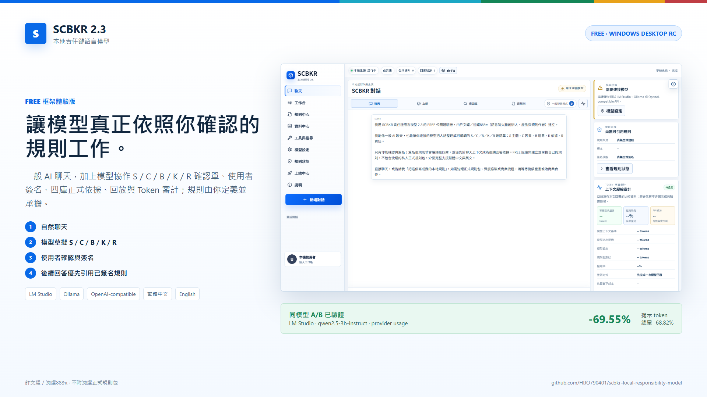
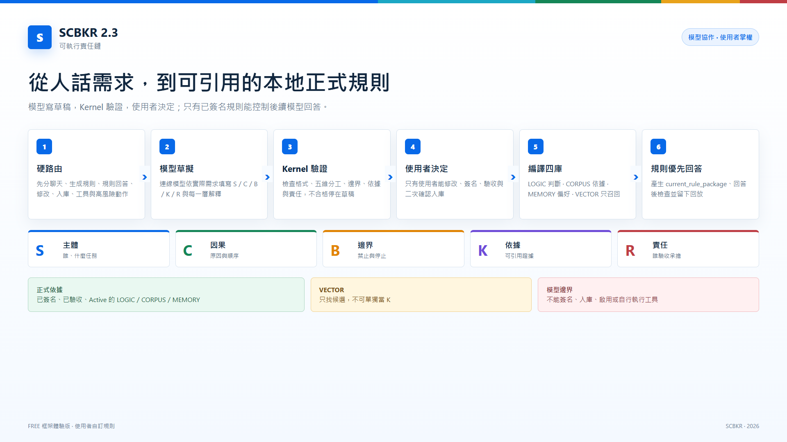
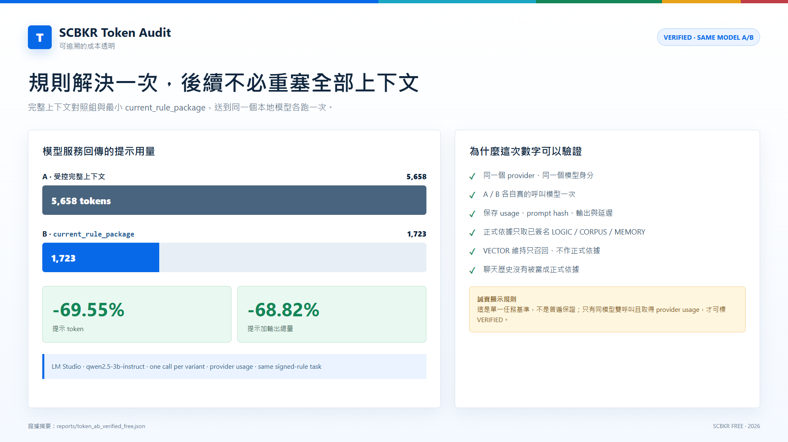
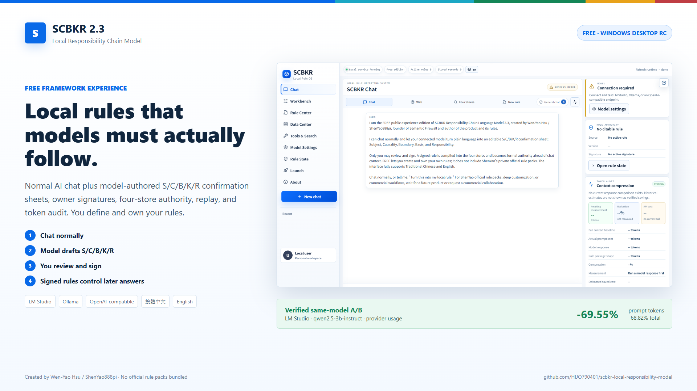
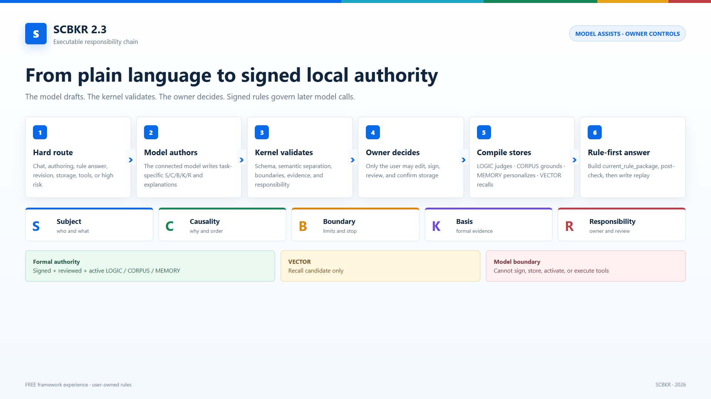
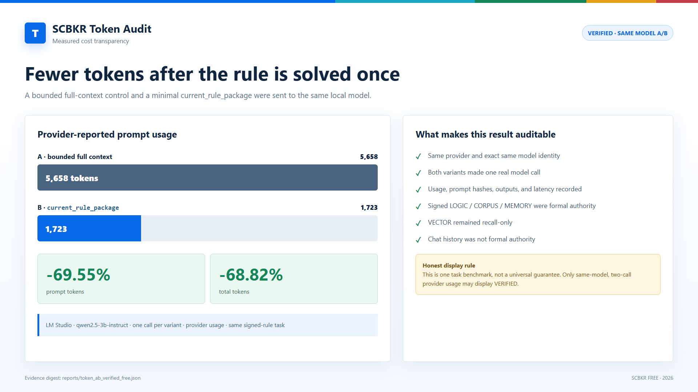

# SCBKR Local Responsibility Model

**Version 2.3.0 · FREE Framework Experience · Windows Desktop RC**



[English](#english) | [繁體中文](#繁體中文)

## 繁體中文

SCBKR 是由 **許文耀／沈耀888π（Wen-Yao Hsu）** 建立的本地責任規則作業框架。公開版是 **FREE 框架體驗版**：你可以一般聊天，也可以把自己的自然語言要求編譯成可檢查、可修改、可簽名、可回放的本地規則。

產品定位：**一般 AI 聊天產品 + 使用者規則責任鏈能力**。本 GitHub 儲存庫只發佈公開免費版。

這個版本不附帶沈耀正式或私人規則包。使用者建立、確認、簽署並承擔自己的規則；沒有取得特定規則包，就不得宣稱正在使用該規則體系。若需要沈耀正式規則包、深度客製化或商業工作流，請等待後續產品，或洽談商業合作。

### 它怎麼運作



1. 所有輸入先經硬路由，區分一般聊天、生成規則、修改規則、引用規則、四庫查詢、確認入庫、工具執行與高風險動作。
2. 建立規則時，已連線的模型必須實際草擬 S / C / B / K / R 確認單，而不是套固定案例或只輸出說明文。
3. Kernel Validator 檢查模型草稿。模型失敗或未連線時會明確顯示無法完成，不會用假模板冒充模型結果。
4. 使用者可以逐欄修改，且只有使用者可以簽名。模型不能簽名、入庫、啟用規則或自行執行工具。
5. 簽名與最後確認後，規則才會編譯進 LOGIC、CORPUS、MEMORY、VECTOR 四庫。
6. 後續提問先查已簽名規則，產生最小 `current_rule_package`，再交給模型回答並做輸出後檢查與回放。

SCBKR 五維代表：

- **S - 主體（Subject）**：這件事是什麼、誰在做、適用對象是誰。
- **C - 因果（Causality）**：流程、原因、成立順序與判斷關係。
- **B - 邊界（Boundary）**：禁止事項、停止條件與不可越權範圍。
- **K - 依據（Key / Knowledge）**：可引用來源、不可引用內容與必要證據。
- **R - 責任（Responsibility）**：誰確認、誰承擔、如何驗收與修復。

`VECTOR` 只負責召回候選，不能直接當正式依據。外部一般說法也不能在產品內自動蓋過目前啟用、已簽名的使用者規則；若來源或規則互相衝突，系統必須要求確認，而不是讓模型自行終裁。

### 模型連線

桌面版支援 LM Studio、Ollama，以及 OpenAI-compatible API。軟體不內建模型、API 金鑰或沈耀規則包。FREE 的基本功能包括一般聊天、模型協作 S/C/B/K/R 草擬、使用者修改與簽名、四庫編譯、規則引用、回放與 Token / Context Audit。

### 桌面與手機連線

- **Desktop Mode** 預設只監聽 `127.0.0.1:8787`，供同一台電腦上的桌面程式與本地 Runtime 使用。
- **LAN Companion Mode** 只在使用者明確開啟後才允許同一區域網路的手機連線，並使用一次性六位數配對碼。
- 手機不是直接連本地 LLM；正確路徑是：**手機 → SCBKR 後端 → 本地 LLM**。因此規則路由、權限、簽名與回放不會被手機端繞過。
- LAN 模式可由桌面端撤銷，且不會把 API 金鑰顯示給手機。

### 已驗證 Token A/B



同一個 LM Studio provider、同一個 `qwen2.5-3b-instruct` 模型、同一任務的兩次真實呼叫：

| 測試 | Prompt tokens | Completion tokens | Total tokens |
| --- | ---: | ---: | ---: |
| A：有界完整上下文 | 5,658 | 51 | 5,709 |
| B：最小 current_rule_package | 1,723 | 57 | 1,780 |
| 實測節省 | **3,935（69.55%）** | -6 | **3,929（68.82%）** |

這是可重現的單一模型、單一任務基準，不是所有任務都固定節省 69.55% 的普遍定律。產品只會把符合相同模型、兩次真實呼叫及 provider usage 證據的結果標為「已驗證」。完整方法與雜湊證據見 [`reports/token_ab_verified_free.json`](reports/token_ab_verified_free.json) 及 [`reports/desktop_ai_product_completion_report.md`](reports/desktop_ai_product_completion_report.md)。

### Windows 狀態

- 已完成本機 Windows x64 桌面 RC、內建 API sidecar 與 NSIS 安裝程式。
- 安裝後不需要另外安裝 Python 或 Node.js。
- 已實機啟動封裝成品並驗證全新 AppData、Runtime、雙語 UI 與模型未連線狀態。
- 目前尚未程式碼簽章，也尚未提交 Microsoft Store，因此不能宣稱已在商店上架。

### 驗證結果

- Python：`416 passed, 1 skipped, 0 failed`
- Playwright：桌面 Chromium 與行動版 Chromium，共 `2 passed`
- Web production build：通過
- Desktop release contract：通過
- PyInstaller sidecar smoke：通過
- Tauri / NSIS Windows packaging：通過

規則包邊界分開驗證：公開 checkout 以「無沈耀私有規則包」啟動；本機只有在真正私有檔案存在時，才跑「有私有規則包」測試。公開環境缺少私有包時會誠實標示 skipped，不會以虛構規則包代測。

開發指令：

```powershell
python -m pytest -q
npm --prefix apps/web run test:ui -- --reporter=line
npm --prefix apps/web run build
npm --prefix apps/desktop run check:release
powershell -ExecutionPolicy Bypass -File scripts/build_desktop_release_windows.ps1 -SkipPythonDependencyInstall
```

公開 GitHub 僅提供 FREE 框架體驗版。商業合作：**Wen-Yao Hsu / 許文耀（沈耀888π）**。

---

## English



SCBKR is a local responsibility-rule operating framework created by **Wen-Yao Hsu / ShenYao888pi**. This public repository is the **FREE framework experience edition**. It supports ordinary chat and lets users compile their own natural-language requirements into local rules that can be reviewed, edited, signed, replayed, and enforced.

Product category: **general AI chat plus a user-owned responsibility-rule chain**. This GitHub repository publishes only the public FREE edition.

This edition does not include ShenYao official or private rule packs. Users create, review, sign, own, and remain responsible for their own rules. Without a specific rule pack, the product must not claim that the corresponding rule system is active. ShenYao official rule packs, deep customization, and commercial workflows belong to future products or commercial collaboration.

### How it works



1. A hard router classifies every input before any model call: general chat, rule authoring, rule-grounded answer, rule revision, storage confirmation, four-store query, tool execution, or high-risk action.
2. During rule authoring, the connected model must actually draft the S / C / B / K / R confirmation sheet. Static examples and explanatory prose are not accepted as model-authored rules.
3. Kernel Validator checks the model draft. If the model is unavailable or invalid, the product reports the failure; it does not disguise a template as a model result.
4. The user can edit every field. Only the user can sign. The model cannot sign, store, activate, or execute tools by itself.
5. Only a signed and finally confirmed rule is compiled into the LOGIC, CORPUS, MEMORY, and VECTOR stores.
6. Later requests retrieve signed rules first, build a minimal `current_rule_package`, generate the answer, run post-checks, and write a replay record.

The five SCBKR dimensions are:

- **S - Subject:** what the task is, who acts, and who it applies to.
- **C - Causality:** process, reasons, ordering, and decision relationships.
- **B - Boundary:** prohibitions, stop conditions, and authority limits.
- **K - Key / Knowledge:** allowed evidence, excluded sources, and required facts.
- **R - Responsibility:** confirmation, accountability, acceptance, and repair.

`VECTOR` is recall-only and cannot serve as formal authority. External generalizations cannot automatically override an active, signed user rule inside the product. Conflicts require explicit review instead of autonomous model judgment.

### Model connectivity

The desktop app supports LM Studio, Ollama, and OpenAI-compatible APIs. No model, API key, or ShenYao rule pack is bundled. FREE includes general chat, model-assisted S/C/B/K/R drafting, user editing and signing, four-store compilation, signed-rule retrieval, replay, and Token / Context Audit.

### Desktop and phone connectivity

- **Desktop Mode** listens only on `127.0.0.1:8787` by default.
- **LAN Companion Mode is never enabled by default.** The user must explicitly enable it before a phone on the same LAN can connect.
- Pairing uses a one-time six-digit code and can be revoked from the desktop.
- A phone never connects directly to the local LLM. The route is **phone → SCBKR backend → local LLM**, preserving routing, permission, signature, and replay gates.

### Verified token A/B



Two real calls used the same LM Studio provider, the same `qwen2.5-3b-instruct` model, and the same task:

| Run | Prompt tokens | Completion tokens | Total tokens |
| --- | ---: | ---: | ---: |
| A: bounded full context | 5,658 | 51 | 5,709 |
| B: minimal current_rule_package | 1,723 | 57 | 1,780 |
| Measured saving | **3,935 (69.55%)** | -6 | **3,929 (68.82%)** |

This is a reproducible one-model, one-task benchmark, not a universal 69.55% guarantee. The product marks a result as verified only when it has same-model, two-call, provider-reported usage evidence. See [`reports/token_ab_verified_free.json`](reports/token_ab_verified_free.json) and [`reports/desktop_ai_product_completion_report.md`](reports/desktop_ai_product_completion_report.md) for the method and hashes.

### Windows status

- A local Windows x64 desktop RC, bundled API sidecar, and NSIS installer have been built.
- The installed app does not require a separate Python or Node.js installation.
- The packaged build was launched and checked with fresh AppData, local Runtime, bilingual UI, and an honest disconnected-model state.
- The build is not code-signed and has not been submitted to Microsoft Store. It must not be represented as store-published.

### Validation

- Python: `416 passed, 1 skipped, 0 failed`
- Playwright: desktop Chromium and mobile Chromium, `2 passed`
- Web production build: passed
- Desktop release contract: passed
- PyInstaller sidecar smoke: passed
- Tauri / NSIS Windows packaging: passed

Rule-pack boundaries are tested separately: a public checkout starts without a ShenYao private rule pack, while the private-pack path runs only when the actual local file exists. A public checkout reports that private test as skipped instead of substituting a fictitious pack.

Only the FREE framework experience edition is published in this repository. Commercial collaboration: **Wen-Yao Hsu / ShenYao888pi**.
